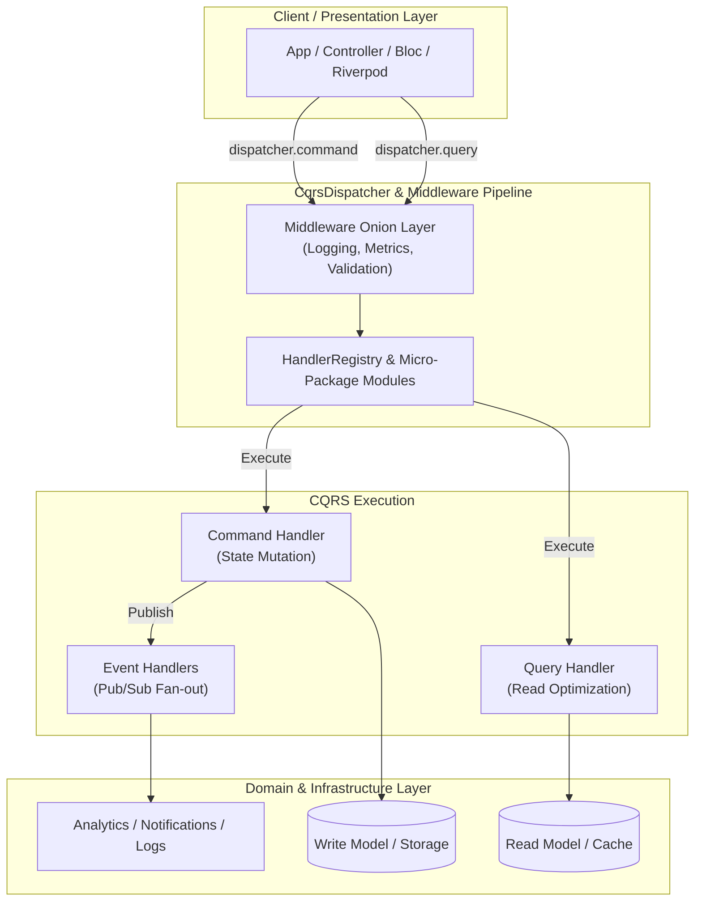

# CQRS for Dart & Flutter

[](https://dart.dev)
[](https://opensource.org/licenses/MIT)
[](https://pub.dev/packages/lints)
[](https://makeapullrequest.com)

A robust, type-safe, and modular **Command Query Responsibility Segregation (CQRS)** and **Event-Driven Architecture** toolkit for Dart and Flutter applications.

---

## Architecture Overview



---

## Monorepo Packages

| Package | Description | Status |
|---|---|---|
| [`packages/cqrs`](packages/cqrs) | Core CQRS primitives: `Command`, `Query`, `Event`, `CqrsDispatcher`, `HandlerRegistry`, and Middlewares. Zero third-party dependencies. | [](packages/cqrs) |
| [`packages/cqrs_codegen`](packages/cqrs_codegen) | `build_runner` generator providing automated handler discovery, collision-free aliased imports, `@CqrsMicroPackage` modularity, and `@CqrsInit` compositors. | [](packages/cqrs_codegen) |
| [`examples/hello_world`](examples/hello_world) | Full-featured example demonstrating CQRS + `injectable` + `get_it` with 1-line locator wiring. | Sample |
| [`examples/codegen_example`](examples/codegen_example) | Multi-feature CQRS application demonstrating micro-packages, sub-modules, and compositor architecture. | Sample |

---

## Key Features

- **Type-Safe & Compile-Time Verified**: Type-safe command and query execution preventing runtime cast errors.
- **Automated Code Generation**: Recursively discovers handlers across directories and generates clean, collision-free `.cqrs.dart` modules.
- **Micro-Packages & Boundary Isolation**: Full support for modular feature folders via `@CqrsMicroPackage`, with automatic boundary detection for nested sub-modules.
- **DI & Service Locator Friendly**: Generate `.fromLocator(...)` factory constructors with 1-line wiring for `get_it`, `injectable`, `Provider`, or `Riverpod`.
- **Middleware Pipeline**: Extensible onion-layer interceptors for cross-cutting concerns (logging, performance tracking, validation, authorization).
- **Event Broadcasting**: Multi-listener event bus supporting concurrent side effects (analytics, push notifications, audit logging).

---

## Quick Start

### 1. Installation

Add `cqrs` and `cqrs_codegen` to your `pubspec.yaml`:

```yaml
dependencies:
  cqrs: ^1.0.0
  cqrs_codegen: ^1.0.0

dev_dependencies:
  build_runner: ^2.4.0
```

### 2. Define Commands, Queries, and Events

```dart
import 'package:cqrs/cqrs.dart';

// 1. Command & Handler
class PlaceOrderCommand implements Command<String> {
  const PlaceOrderCommand({required this.item, required this.amount});
  final String item;
  final double amount;
}

class PlaceOrderCommandHandler implements CommandHandler<PlaceOrderCommand, String> {
  PlaceOrderCommandHandler({required this.repository, required this.publisher});
  final OrderRepository repository;
  final EventPublisher publisher;

  @override
  Future<String> execute(PlaceOrderCommand command) async {
    final orderId = repository.save(command.item, command.amount);
    await publisher.publish(OrderPlacedEvent(orderId: orderId));
    return orderId;
  }
}

// 2. Query & Handler
class GetOrderQuery implements Query<Order?> {
  const GetOrderQuery(this.orderId);
  final String orderId;
}

class GetOrderQueryHandler implements QueryHandler<GetOrderQuery, Order?> {
  GetOrderQueryHandler(this.repository);
  final OrderRepository repository;

  @override
  Future<Order?> execute(GetOrderQuery query) async => repository.findById(query.orderId);
}

// 3. Event & Handler
class OrderPlacedEvent extends Event {
  OrderPlacedEvent({required this.orderId});
  final String orderId;
}

class OrderAnalyticsHandler implements EventHandler<OrderPlacedEvent> {
  @override
  Future<void> handle(OrderPlacedEvent event) async {
    print('Analytics: Order placed -> ${event.orderId}');
  }
}
```

### 3. Feature Micro-Package

Annotate feature entry points with `@CqrsMicroPackage`:

```dart
// lib/features/orders/orders_handler.dart
import 'package:cqrs_codegen/cqrs_codegen.dart';

export 'orders_handler.cqrs.dart';

@CqrsMicroPackage(moduleName: 'Orders')
void configureOrdersHandlers() {}
```

### 4. Root Application Compositor

Compose all micro-packages in `lib/cqrs_init.dart`:

```dart
// lib/cqrs_init.dart
import 'package:cqrs_codegen/cqrs_codegen.dart';

import 'features/billing/billing_handler.dart';
import 'features/orders/orders_handler.dart';

export 'cqrs_init.cqrs.dart';
export 'features/billing/billing_handler.dart';
export 'features/orders/orders_handler.dart';

@CqrsInit(
  moduleName: 'App',
  useMicroPackage: true,
  generateInjectable: true, // Enables .fromLocator(...) for GetIt / Injectable
  modules: [
    OrdersCqrsModule,
    BillingCqrsModule,
  ],
)
void configureCqrs() {}
```

### 5. Run Code Generation

```bash
dart run build_runner build
```

---

## Dependency Injection & `get_it` Integration

When `generateInjectable: true` is enabled, all modules and compositors generate `.fromLocator(...)` constructors:

```dart
// lib/injection.dart
import 'package:cqrs/cqrs.dart';
import 'package:get_it/get_it.dart';
import 'package:injectable/injectable.dart';

import 'cqrs_init.dart';
import 'injection.config.dart';

final getIt = GetIt.instance;

@ExternalModule()
abstract class CqrsModule {
  @Injectable(scope: Scope.singleton)
  CqrsDispatcher get cqrsDispatcher => CqrsDispatcher()
    ..registry.registerModule(AppCqrsModule.fromLocator(getIt.get));
}

@InjectableInit(initializerName: 'bootstrap')
Future<void> configureDependencies() async => getIt.bootstrap();
```

---

## Middlewares (Onion Layer)

Middlewares wrap command, query, and event execution with before/after logic:

```dart
final dispatcher = CqrsDispatcher(
  commandMiddlewares: [
    (command, next) async {
      print('[Command] Executing: ${command.runtimeType}');
      final stopwatch = Stopwatch()..start();
      final result = await next();
      print('[Command] Finished in ${stopwatch.elapsedMilliseconds}ms');
      return result;
    },
  ],
  queryMiddlewares: [
    (query, next) async {
      print('[Query] Fetching: ${query.runtimeType}');
      return await next();
    },
  ],
  eventMiddlewares: [
    (event, next) async {
      print('[Event] Broadcasting: ${event.runtimeType}');
      await next();
    },
  ],
);
```

---

## Monorepo Development

This repository uses [Dart Pub Workspaces](https://dart.dev/tools/pub/workspaces) and [Melos](https://pub.dev/packages/melos).

### Setup

```bash
# Get dependencies across all workspace packages
dart pub get
```

### Workspace Commands

| Command | Description |
|---|---|
| `dart test examples/codegen_example/test/ examples/hello_world/test/ packages/cqrs_codegen/test/ packages/cqrs/test/` | Run all test suites across the workspace |
| `dart analyze` | Analyze all packages with zero lints or warnings |
| `dart run build_runner build` | Run code generation for any example package |

### Running the Examples

```bash
# 1. Run hello_world (CQRS + Injectable + GetIt)
cd examples/hello_world
dart run bin/hello_world.dart

# 2. Run codegen_example (Pure standalone micro-packages)
cd examples/codegen_example
dart run bin/main.dart
```

---

## License

This project is licensed under the MIT License — see the [LICENSE](LICENSE) file for details.
